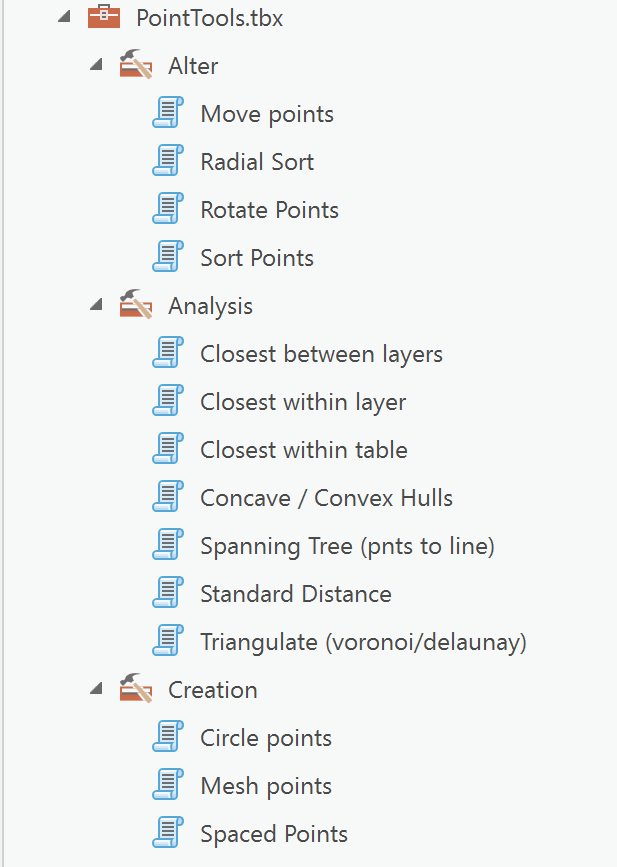

**PointTools**
----

Tools for working with point featureclasses.

Developed in ArcGIS PRO.

Most tools use NumPy for their data processing (numpy >= 1.16 should be fine).

*Notes*

- Download the zip file and unzip in a folder.
- Add the toolbox to your project.

The scripts can be examined here without having to download the zip.

**Toolbox, Toolsets and Tools**

There are 3 toolsets:
 - Alter
 - Analysis
 - Creation

Some of these would normally require an Advanced license for ArcGIS Pro, however, the functionality can largely be replicated using python, numpy or scipy and arcpy.

