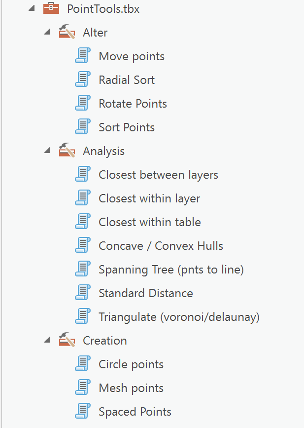

**PointTools**
----
**last update : 2026-06-18**

Tools for working with point featureclasses.

Developed in ArcGIS PRO.

Most tools use NumPy for their data processing.

*Notes*

- Download the zip file and unzip in a folder.
- Add the toolbox to your project.
- There is a atbx and tbx version of the toolboxes, the contents of the Scripts folder is also available here if you just want to examine script contents.

**Toolbox, Toolsets and Tools**

There are 3 toolsets:
 - Alter
 - Analysis
 - Creation

Some of these would normally require an Advanced license for ArcGIS Pro, however, the functionality can largely be replicated using python, numpy or scipy and arcpy.

